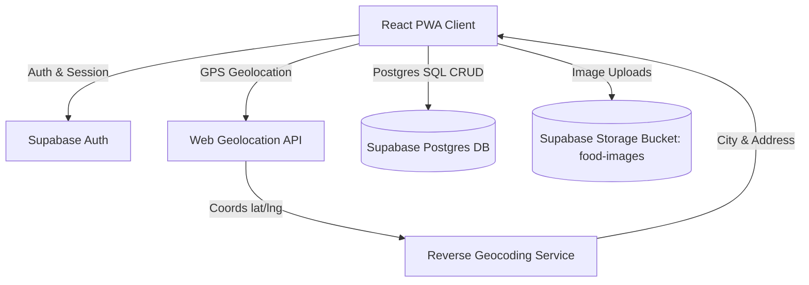

# Gourmet Food Log - Personal Food Diary Design Spec

**Date:** 2026-08-12  
**Status:** Approved  
**Target Platform:** Mobile-First Responsive Web Application (PWA Ready)  

---

## 1. System Overview & Architecture

The Gourmet Food Log is a high-end personal food memory application designed for food lovers to document, map, and organize their culinary experiences. Built with a mobile-first responsive web paradigm, the application integrates cloud synchronization via **Supabase** for data, user auth, and high-resolution photo storage, complemented by automatic **GPS geolocation reverse-geocoding** for seamless city/address logging.



---

## 2. Tech Stack & Dependencies

- **Frontend Framework:** React 18 + Vite (ESM)
- **Styling & Design System:** Vanilla CSS Modules / CSS Variables with custom high-end theme tokens
- **Animations & Physics:** Framer Motion (`framer-motion`) + Lucide Icons (`lucide-react`)
- **Backend & Cloud Services:** `@supabase/supabase-js`
  - **Auth:** Email / Password registration & login
  - **Database:** Supabase PostgreSQL with Row Level Security (RLS)
  - **Storage:** Supabase Storage (`food-images` bucket)
- **Geolocation & Reverse Geocoding:** Browser `navigator.geolocation` API + OpenStreetMap Nominatim / Reverse Geocode API
- **Date & Image Utilities:** `browser-image-compression` for web optimization before upload

---

## 3. User Authentication & Profile Workflow

1. **Registration (`/register`)**:
   - Form fields: Email, Password, Username.
   - On submission, calls `supabase.auth.signUp()`.
   - Automatically inserts initial row into `profiles` table via database trigger or post-signup hook.
2. **Login (`/login`)**:
   - Form fields: Email, Password.
   - Calls `supabase.auth.signInWithPassword()`.
   - Persists session in `localStorage` automatically via Supabase SDK.
3. **Mandatory Login Enforcement**:
   - Creating, editing, or uploading food logs strictly requires an active user session (`auth.uid() != null`).
   - If an unauthenticated user attempts to click the "新增打卡 (+)" button, an elegant login modal/drawer is triggered automatically, requiring sign-in or registration before proceeding.

---

## 4. Geolocation & Reverse Geocoding City Detection

1. When opening the **Add Food Log** modal or clicking **"GPS 定位"**:
   - Trigger `navigator.geolocation.getCurrentPosition()`.
   - Store exact `latitude` and `longitude` in form state.
2. Immediately dispatch reverse-geocoding request:
   - Request URL: `https://nominatim.openstreetmap.org/reverse?format=json&lat={lat}&lon={lng}&accept-language=zh`
   - Extract `city` (or `town`/`county` fallback) and `road`/`suburb` address.
3. Auto-populate `city` and `address` fields in the UI, with full user edit capability.

---

## 5. Core Features & User Journeys

### A. Dynamic Food Feed (Visual Gallery)
- Masonry / Grid layout of food cards with high-res photos.
- Each card displays dish image, restaurant name, city pill tag, star rating (1-5 stars), price per person, recommended dishes, and dining date.
- Hover & active tap animations with smooth image zoom.

### B. Interactive Food Log Drawer / Modal
- Photo upload with drag-and-drop & instant thumbnail preview.
- One-click GPS location & city auto-fetch button.
- Star rating interactive slider/button group.
- Multi-tag input (e.g. `#老字号`, `#日料`, `#约会`).
- Recommended dish tags creation.
- Rich text review / notes field.

### C. Filtering & Search Header
- Search by keyword (restaurant name, dish name, notes).
- City filter pills ("全部", "成都", "北京", "上海", etc.).
- Rating filter (e.g. "5星必吃", "4星以上").

### D. Analytics & Gourmet Stats
- Counter cards: Total restaurants logged, Total cities visited, Average spending, Top cuisine tag.

---

## 6. Database Schema (Supabase Postgres)

```sql
-- Profiles Table
create table public.profiles (
  id uuid references auth.users on delete cascade primary key,
  username text not null,
  avatar_url text,
  created_at timestamptz default now() not null
);

-- Food Logs Table
create table public.food_logs (
  id uuid default gen_random_uuid() primary key,
  user_id uuid references public.profiles(id) on delete cascade not null,
  title text not null,
  restaurant_name text not null,
  city text not null,
  address text,
  latitude float8,
  longitude float8,
  rating smallint check (rating >= 1 and rating <= 5) not null default 5,
  price_per_person numeric(10, 2),
  recommended_dishes text[] default '{}'::text[],
  tags text[] default '{}'::text[],
  image_urls text[] not null default '{}'::text[],
  notes text,
  dining_date date default current_date not null,
  created_at timestamptz default now() not null,
  updated_at timestamptz default now() not null
);

-- Enable RLS
alter table public.profiles enable row level security;
alter table public.food_logs enable row level security;

-- RLS Policies
create policy "Users can view own profile" on public.profiles
  for select using (auth.uid() = id);

create policy "Users can update own profile" on public.profiles
  for update using (auth.uid() = id);

create policy "Users can insert own profile" on public.profiles
  for insert with check (auth.uid() = id);

create policy "Users can view own food logs" on public.food_logs
  for select using (auth.uid() = user_id);

create policy "Users can insert own food logs" on public.food_logs
  for insert with check (auth.uid() = user_id);

create policy "Users can update own food logs" on public.food_logs
  for update using (auth.uid() = user_id);

create policy "Users can delete own food logs" on public.food_logs
  for delete using (auth.uid() = user_id);
```

---

## 7. Storage Bucket & Compression Pipeline

- **Storage Bucket**: `food-images`
- **Upload Flow**:
  1. Client selects image files (JPEG/PNG/WebP).
  2. Front-end compresses file using `browser-image-compression` (max width 1600px, quality 0.85).
  3. Upload file to Supabase Storage: `${user_id}/${Date.now()}_${sanitizedFilename}`.
  4. Generate public URL for database storage in `food_logs.image_urls`.

---

## 8. High-End Design System & Motion Specs

### Color Palette (Ember Amber Theme)
- Primary Accent: `#FF6B35` to `#F59E0B` (Warm Glow Gradient)
- Dark Theme BG: `#0F1117`
- Dark Card Surface: `#181B24`
- Dark Glass Surface: `rgba(24, 27, 36, 0.7)` with `backdrop-filter: blur(20px)`
- Border Accent: `rgba(255, 255, 255, 0.08)`
- Text Primary: `#F9FAFB`
- Text Muted: `#9CA3AF`

### Typography System
- Headings: `'Outfit', 'Plus Jakarta Sans', 'Noto Sans SC', sans-serif`
- Body: `'Inter', 'Noto Sans SC', sans-serif`
- Monospace/Numbers: `'JetBrains Mono', tabular-nums`

### Micro-Animations (Framer Motion)
- **Spring Physics**: `type: "spring", stiffness: 300, damping: 26`
- **Modal Reveal**: `initial={{ opacity: 0, y: 40, scale: 0.95 }}` $\rightarrow$ `animate={{ opacity: 1, y: 0, scale: 1 }}`
- **Card Hover**: `whileHover={{ y: -6, transition: { duration: 0.2 } }}`
- **Card Tap**: `whileTap={{ scale: 0.97 }}`
- **Star Bounce**: `whileTap={{ scale: 1.35, rotate: 15 }}`
- **Layout Transition**: Shared layout ID on filter tag highlights (`layoutId="activeTag"`).

---

## 9. Verification & Success Criteria

1. User can register a new account or log in via Supabase Auth.
2. Clicking "GPS 定位" fetches latitude/longitude and correctly populates the current city name.
3. User can upload food photos, set ratings, tags, price, and save a food log to Supabase.
4. Food logs persist in Supabase DB and load across browser reloads or logins on different devices.
5. High-end animations and theme styling render without stuttering or layout shift.
